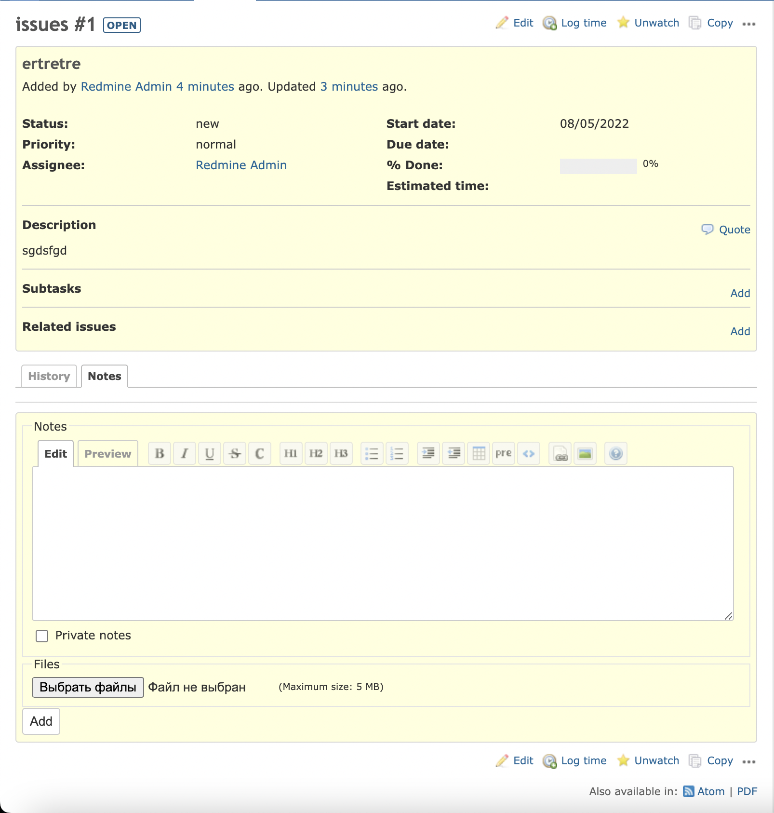
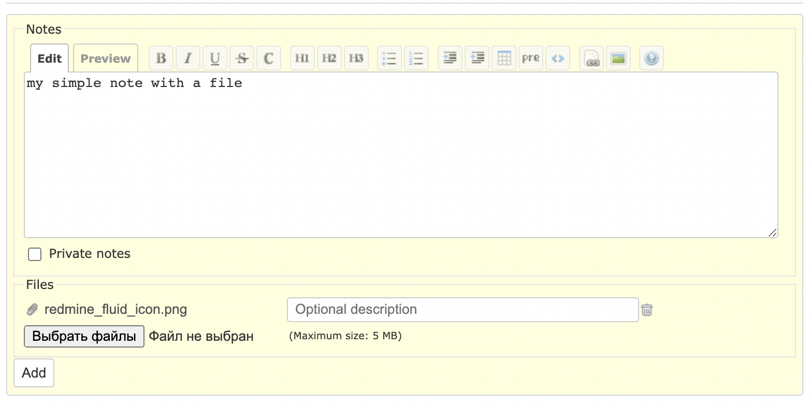
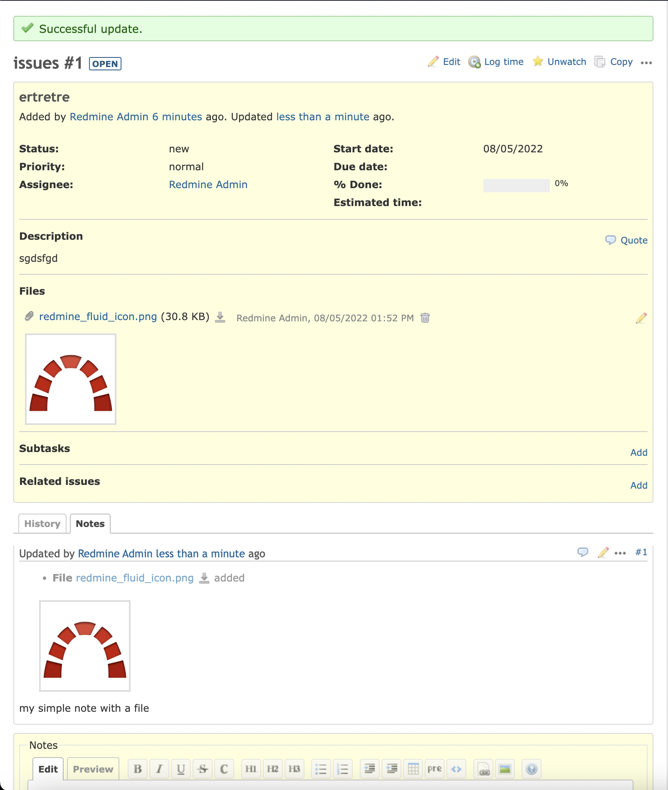
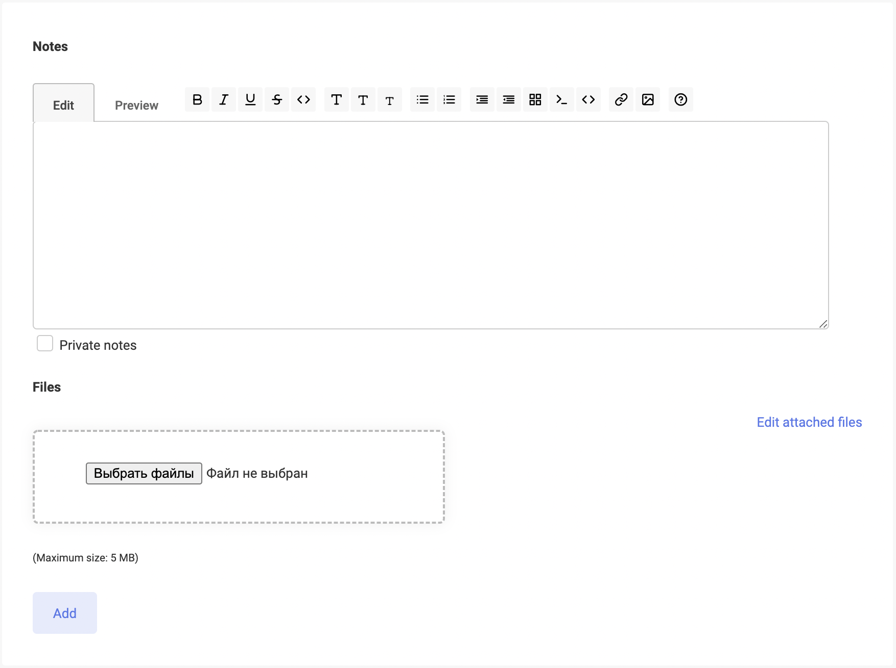

# redmine 5 add note

By default adding comments (notes) to tasks is made by editing the task itself.
This is absolutely counter-intuitive and very inconvenient 

This patch will make adding comments (notes) to issues more human-friendly.

Tested with Redmine 5.0.2.

To apply, copy the file `add-only-notes.patch` to root of your redmine and run patch command (requires git):
```
patch -p1 < add-only-notes.patch
```

For docker build example see dockerfile.

## Screenshots







## With zenmine theme

